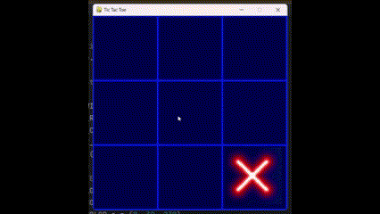

# Tic Tac Toe with Football 
## Interactive Wall Football Game using a projector and 2 cameras
Tools & Technologies: Python, Yolov10, OpenCV, Ultralytics, Pygame, Perspective Transform 
•	Used Yolov10 to train and deploy the ball object detection model.
•	Developed a wall camera script to detect when the ball hits the wall (1st camera).
•	Developed a script to extract the location information of the ball from the model output (2nd camera).
•	Calibrated the camera and performed perspective transform to project the results accurately in the projector screen.
•	Developed a Tic Tac Toe game using Pygame to import with the main script.

## No preview of the project is available yet. However, here is something like the required final result:

### preview of the game on PC:

