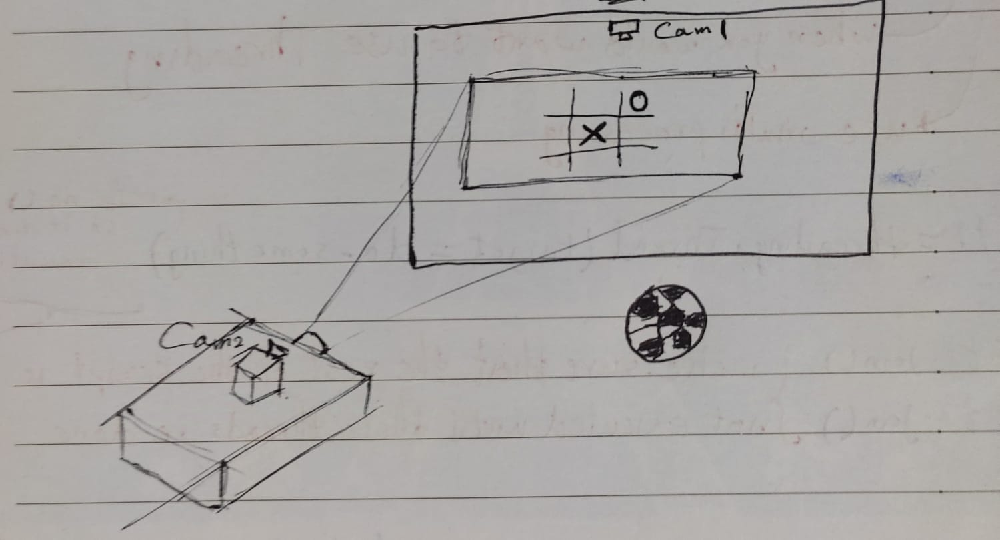
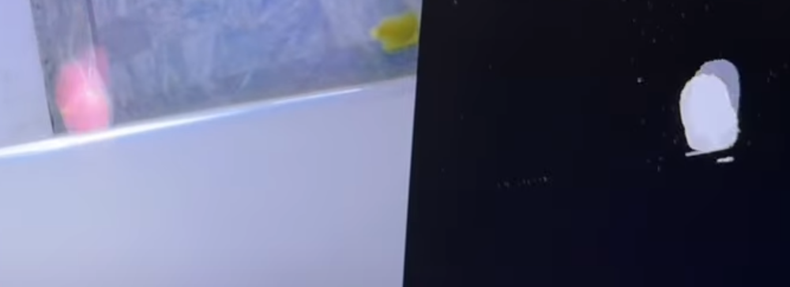
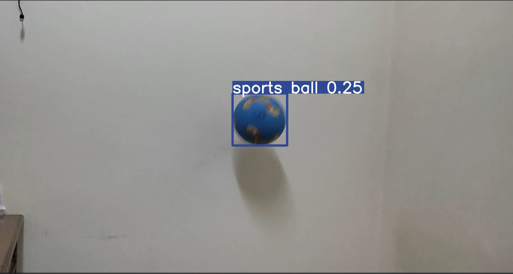

# Tic Tac Toe with Football 
## Interactive Wall Football Game using a projector and 2 cameras
Tools & Technologies: Python, Yolov8, OpenCV, Ultralytics, Pygame, Perspective Transform  
•	Used Yolov10 to train and deploy the ball object detection model.  
•	Developed a wall camera script to detect when the ball hits the wall (1st camera).  
•	Developed a script to extract the location information of the ball from the model output (2nd camera).  
•	Calibrated the camera and performed perspective transform to project the results accurately on the projector screen.  
•	Developed a Tic Tac Toe game using Pygame to import with the main script.  

## No preview of the project is available yet. However, here is what the required final result should look like:

## the 1st camera mounted on the wall and the 2nd mounted on the projector  

## 1st cam preview
Objective: detect when the ball hits by tracking the color change.  

## 2nd cam preview  
objective: detect where the ball hits using the YOLO model.

### Preview of the game on PC:

